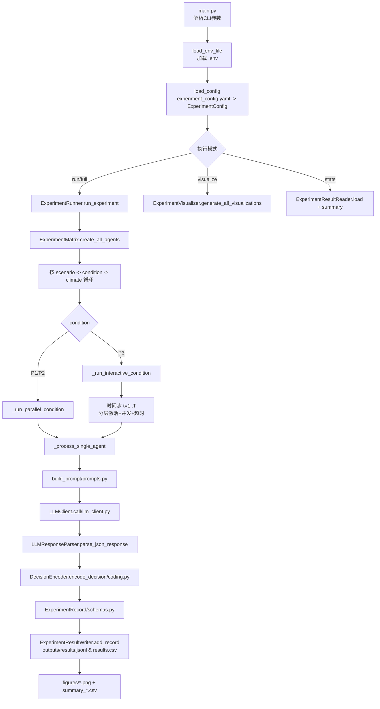
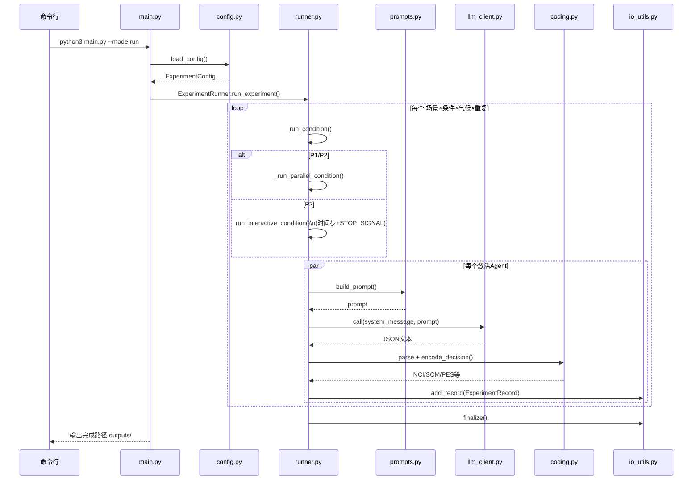

# 数据流程图讲解

## 一页式总览（当前代码）

### 1) 代码数据流程图



### 2) 代码运行逻辑（控制流）



### 3) P3（高阶互动）关键停止条件

- `max_timestep`：达到最大时间步停止
- `high_consensus`：`GCR >= threshold` 且连续保持 `N` 步
- `discussion_stalled`：评论事件连续停滞 `N` 步

---

本文档详细说明项目中数据的流动、处理和转换过程。

---

## 1. 整体数据流程图

```
┌─────────────────────────────────────────────────────────────────────────────┐
│                           【实验整体数据流】                                  │
└─────────────────────────────────────────────────────────────────────────────┘

    配置层
    ┌────────────────────────────────────────────┐
    │    experiment_config.yaml                  │
    │  (唯一配置文件：模型、并发、实验方案等)    │
    └────────────────┬─────────────────────────┘
                     │
                     ▼
    ┌────────────────────────────────────────────┐
    │  config.py: load_config()                  │
    │  (加载并解析配置，返回 ExperimentConfig)   │
    └────────────────┬─────────────────────────┘
                     │
    ─────────────────┴──────────────────────────────────────────
    │                │                          │               │
    │                ▼                          │               │
    │         ┌──────────────┐                  │               │
    │         │ env_utils.py │                  │               │
    │         │ (读取环境    │                  │               │
    │         │  变量API Key)│                  │               │
    │         └──────────────┘                  │               │
    │                                           │               │
    ▼                                           ▼               ▼
┌──────────────────────────┐      ┌─────────────────────┐   ┌──────────────┐
│  环境参数                 │      │  实验设计参数        │   │  模型配置    │
│ • ZHIPU_API_KEY         │      │ • 条件(P1/P2/P3)   │   │ • 模型名称   │
│ • OPENAI_API_KEY        │      │ • 场景(scenarios)  │   │ • API样式    │
│                          │      │ • 个性(personas)   │   │ • 温度等     │
└──────────────────────────┘      │ • 气候(climates)   │   └──────────────┘
                                  │ • 并发数、重复次数  │
                                  └─────────────────────┘
                                           │
                                           ▼
                          ┌──────────────────────────────┐
                          │  runner.py: run_experiment() │
                          │  (主实验循环)                 │
                          └──────────────────────────────┘
                                           │
                ───────────────────────────┼────────────────────────────
                │                          │                          │
                ▼                          ▼                          ▼
    ┌────────────────────┐    ┌────────────────────┐    ┌────────────────────┐
    │ prompts.py         │    │ llm_client.py      │    │ modeling.py        │
    │ (构建提示词)        │    │ (调用 LLM API)     │    │ (初始化 Agent)     │
    │ • 系统提示词        │    │ • Zhipu GLM API    │    │ • 个性初始化       │
    │ • 用户消息         │    │ • OpenAI API       │    │ • NCI 初始值=2.0   │
    └────────────────────┘    └────────────────────┘    │ • 状态管理         │
           │                          │                   └────────────────────┘
           └──────────────┬───────────┘                           │
                          │                                       │
                          ▼                                       │
                  ┌──────────────────┐                           │
                  │ LLM 模型响应      │                           │
                  │ (JSON格式)       │                           │
                  └──────────────────┘                           │
                          │                                       │
                          ├──────────────────────────────────────┤
                          │                                       │
                          ▼                                       ▼
              ┌─────────────────────┐          ┌──────────────────────┐
              │ 解析响应             │          │ AgentState 对象      │
              │ • credible_choice   │          │ • current_nci        │
              │ • like_choice       │          │ • stance_history     │
              │ • share_choice      │          │ • decision_history   │
              │ • comment_choice    │          └──────────────────────┘
              └─────────────────────┘                    │
                          │                              │
                          ▼                              ▼
                  ┌──────────────────┐        ┌──────────────────┐
                  │ coding.py        │        │ interaction.py   │
                  │ (编码和计算)      │        │ (高阶互动处理)   │
                  │ • 计算 NCI       │        │ • 多 Agent 讨论  │
                  │ • 计算 SCM       │        │ • 生成互动评论   │
                  │ • 计算 PES       │        │ • 更新群体共识   │
                  │ • 计算其他指标   │        └──────────────────┘
                  └─────────────────────────────────────┬
                                                        │
                                                        ▼
                            ┌────────────────────────────────────┐
                            │ ExperimentRecord 对象              │
                            │ • agent_id                         │
                            │ • scenario_name                    │
                            │ • condition_name                   │
                            │ • persona_name                     │
                            │ • decision_response                │
                            │ • negative_choice_index (NCI)      │
                            │ • stance_change_magnitude (SCM)    │
                            │ • persuasion_effect_score (PES)    │
                            │ • 其他指标...                      │
                            └────────────────────────────────────┘
                                           │
                            ┌──────────────┴──────────────┐
                            ▼                             ▼
                  ┌──────────────────┐      ┌──────────────────────┐
                  │ io_utils.py      │      │ visualize.py         │
                  │ (数据持久化)      │      │ (生成可视化)         │
                  │ • JSONL 格式     │      │ • NCI 对比图         │
                  │ • CSV 格式       │      │ • 平台效应图         │
                  │ • 统计分析       │      │ • 个性效应图         │
                  │ • 汇总统计       │      │ • 热力图             │
                  └──────────────────┘      └──────────────────────┘
                            │                             │
                            ▼                             ▼
        ┌───────────────────────────────┐   ┌────────────────────┐
        │ outputs/ 目录                 │   │ outputs/figures/   │
        │ • results.jsonl               │   │ • nci_comparison   │
        │ • results.csv                 │   │ • platform_effect  │
        │ • summary_*.csv               │   │ • persona_effect   │
        │ • experiment.log              │   │ • heatmap_*        │
        └───────────────────────────────┘   └────────────────────┘
```

---

## 2. 数据模型与结构

### 2.1 核心数据模型

#### ExperimentConfig (config.py)
```
ExperimentConfig
├─ model: ModelConfig
│  ├─ name: str (模型名: "glm-4" / "glm-4.5-air")
│  ├─ api_style: str ("zhipu" / "openai")
│  ├─ temperature: float (0.2)
│  └─ max_tokens: int (500)
│
├─ active_plan: str ("pilot" / "formal" / "custom")
├─ conditions: List[ConditionName] (["independent", "low_feedback", "high_interaction"])
├─ personas: List[Persona]
│  ├─ name: str
│  ├─ persona_type: str
│  └─ profile: str
│
├─ scenarios: List[Scenario]
│  ├─ name: str
│  ├─ background: str
│  ├─ positive_narrative: str
│  └─ negative_narrative: str
│
├─ concurrency: int (5)
├─ repeats_per_cell: int (2)
└─ random_seed: int (42)
```

#### AgentState (schemas.py)
```
AgentState
├─ agent_id: str
├─ persona: Persona
├─ current_nci: float (初值: 2.0)
├─ stance_history: List[float] ([2.0])
├─ decision_history: List[DecisionResponse]
├─ persuasion_effects: List[float]
└─ group_consensus_ratio: float (0.0)
```

#### DecisionResponse (schemas.py)
```
DecisionResponse
├─ credible_choice: CredibilityChoice ("positive" / "neutral" / "negative")
├─ like_choice: LikesChoice ("positive" / "negative" / "none")
├─ share_choice: SharesChoice ("positive" / "negative" / "none")
└─ comment_choice: CommentChoice ("support_positive" / "support_negative" / "neutral" / "none")
```

#### ExperimentRecord (schemas.py)
```
ExperimentRecord
├─ agent_id: str
├─ scenario_name: str
├─ condition_name: str
├─ persona_name: str
├─ climate_type: str
├─ decision_response: DecisionResponse
├─ credible_choice: str (从 decision_response 提取)
├─ negative_choice_index: float (NCI 值)
├─ stance_change: float (SCM 值)
├─ persuasion_effect: float (PES 值)
├─ group_consensus: float (GCR 值)
├─ timestamp: datetime
└─ metadata: dict (其他信息)
```

---

## 3. 关键处理步骤

### 3.1 配置加载流程

```
user input (experiment_config.yaml)
    │
    ▼
load_config() 加载 YAML 文件
    │
    ├─ 解析配置参数
    └─ 验证配置合法性 (Pydantic)
    │
    ▼
ExperimentConfig 对象
    ├─ 计算实验规模
    └─ 初始化所有参数
    │
    ▼
配置就绪，返回给 runner
```

### 3.2 单个 Agent 决策流程

```
【输入】
├─ agent_id
├─ scenario
├─ condition (P1/P2/P3)
├─ persona
└─ climate_type

    ▼
【prompts.py: build_prompt()】
├─ 根据 persona 生成系统提示词
├─ 根据 scenario 生成场景描述
├─ 根据 condition 添加社交信号
│  ├─ P1: 不添加
│  ├─ P2: 添加静态社交信号 (点赞数、分享数)
│  └─ P3: 添加动态讨论 (其他 Agent 评论)
└─ 返回完整提示

    ▼
【llm_client.py: call()】
├─ ZhipuGLMClient 或 OpenAIClient
├─ 发送请求到 API
└─ 返回 JSON 响应

    ▼
【解析响应】
├─ 检查响应格式
├─ 提取四维决策
│  ├─ credible_choice
│  ├─ like_choice
│  ├─ share_choice
│  └─ comment_choice
└─ 创建 DecisionResponse 对象

    ▼
【AgentState 更新】
├─ 记录新的决策
├─ 更新 stance_history
└─ 更新 decision_history

    ▼
【coding.py: encode_decision()】
├─ 计算 Stance 值
│  = ContentScore + SocialScore + GroupScore
├─ 计算 NCI (Negative Choice Index)
│  = 2.0 + Stance × (4/3), 范围 [0, 4]
├─ 计算 SCM (Stance Change Magnitude)
│  = |current_NCI - previous_NCI|
├─ 计算 PES (Persuasion Effect Score)
│  = |SocialScore + GroupScore|
└─ 计算其他指标

    ▼
【创建 ExperimentRecord】
├─ 复制所有决策信息
├─ 添加计算的指标
└─ 记录时间戳

【输出】
└─ ExperimentRecord 对象
```

### 3.3 高阶互动 (P3) 流程

```
【P3: 高互动平台】

Round 1: 初始决策
├─ Agent_1 看不到其他人评论 → DecisionResponse_1
├─ Agent_2 看不到其他人评论 → DecisionResponse_2
└─ Agent_3 看不到其他人评论 → DecisionResponse_3

    ▼
interaction.py: aggregate_decision() 
├─ 汇总三个决策
├─ 计算群体共识比例 (GCR)
│  = max(支持正向比例, 支持负向比例)
├─ 生成互动评论
│  (由 LLM 生成其他 Agent 对此决策的评价)
└─ 更新社交信号

Round 2: 受社交信号影响的决策
├─ Agent_1 看到 [评论_2, 评论_3, GCR] → DecisionResponse_1'
├─ Agent_2 看到 [评论_1, 评论_3, GCR] → DecisionResponse_2'
└─ Agent_3 看到 [评论_1, 评论_2, GCR] → DecisionResponse_3'

    ▼
停止条件检查
├─ 如果 GCR >= 0.90 → 停止讨论
├─ 或达到最大轮数 → 停止讨论
└─ 否则 → 继续下一轮

    ▼
interaction.py: record_interaction()
├─ 记录每一轮的所有决策
├─ 记录 NCI 演化过程
├─ 记录群体共识演化
└─ 记录讨论过程中的所有变化
```

---

## 4. 实验执行流程

### runner.py: run_experiment()

```
【初始化阶段】
│
├─ load_config()
│  └─ 加载实验配置
│
├─ create_agents()
│  └─ 为每个 (条件, 场景, 个性, 气候) 组合创建 agents
│     示例: 3条件 × 2场景 × 3个性 × 2气候 × 20 agents = 2,160 agents
│
├─ init_experiment_state()
│  └─ 初始化所有 agent 的 NCI = 2.0
│
└─ create_result_writer()
   └─ 为输出做准备

    ▼
【并发执行阶段】使用 asyncio
│
├─ for condition in conditions:
│  └─ for scenario in scenarios:
│     └─ for persona in personas:
│        └─ for climate in climates:
│           └─ 执行该组合的 agents
│
├─ 如果是 P3 (high_interaction):
│  ├─ 调用 run_high_interaction_rounds()
│  ├─ 执行多轮讨论
│  └─ 记录动态变化
│
├─ 否则 (P1 或 P2):
│  └─ 执行单轮决策
│
└─ 使用 Semaphore 控制并发数量
   └─ 同时最多 concurrency 个 agents

    ▼
【结果聚合阶段】
│
├─ 收集所有 ExperimentRecord
├─ 按条件/个性/场景分组统计
├─ 计算多维度汇总
│  ├─ summary_by_condition
│  ├─ summary_by_persona
│  ├─ summary_by_scenario
│  └─ summary_multidimensional
│
└─ io_utils 保存结果
   ├─ 写入 results.jsonl (原始数据)
   ├─ 写入 results.csv (表格格式)
   └─ 写入 summary_*.csv (汇总统计)

    ▼
【可视化阶段】
│
├─ visualize.py 加载结果
├─ 生成各类图表
│  ├─ NCI 对比柱状图
│  ├─ 平台效应折线图
│  ├─ 个性效应雷达图
│  ├─ 热力图 (多维分析)
│  └─ 假设验证图
│
└─ 保存到 outputs/figures/

    ▼
【输出】
└─ 完整实验结果与可视化
```

---

## 5. 数据存储格式

### 5.1 JSONL 格式 (results.jsonl)

每行是一个 JSON 对象，对应一个 ExperimentRecord：

```json
{
  "agent_id": "agent_001_risk_sensitive_mycoplasma_pneumonia_independent",
  "scenario_name": "mycoplasma_pneumonia",
  "condition_name": "independent",
  "persona_name": "risk_sensitive",
  "climate_type": "negative_leaning",
  "decision_response": {
    "credible_choice": "negative",
    "like_choice": "negative",
    "share_choice": "negative",
    "comment_choice": "support_negative"
  },
  "credible_choice": "negative",
  "negative_choice_index": 3.5,
  "stance_change_magnitude": 0.0,
  "persuasion_effect_score": 0.0,
  "group_consensus_ratio": 0.0,
  "timestamp": "2026-03-30T10:30:45.123456Z"
}
```

### 5.2 CSV 格式 (results.csv)

表格形式，便于用 Excel/Pandas 分析：

```
agent_id,scenario_name,condition_name,persona_name,climate_type,
credible_choice,like_choice,share_choice,comment_choice,
negative_choice_index,stance_change_magnitude,persuasion_effect_score,
group_consensus_ratio,timestamp

agent_001...,mycoplasma_pneumonia,independent,risk_sensitive,negative_leaning,
negative,negative,negative,support_negative,3.5,0.0,0.0,0.0,2026-03-30T10:30:45Z
```

### 5.3 汇总统计格式

#### summary_by_condition.csv
```
condition,avg_nci,std_nci,avg_scm,avg_pes,
min_nci,max_nci,count

independent,2.15,0.45,0.12,0.05,0.5,3.8,120
low_feedback,2.65,0.52,0.18,0.25,0.8,3.9,120
high_interaction,2.85,0.48,0.22,0.35,1.2,3.95,120
```

#### summary_by_persona.csv
```
persona_name,avg_nci,std_nci,avg_scm,avg_pes,
min_nci,max_nci,count

risk_sensitive,2.85,0.50,0.20,0.30,1.0,3.95,120
authority_trusting,2.30,0.48,0.15,0.15,0.5,3.5,120
neutral_prudent,2.50,0.45,0.17,0.25,0.8,3.8,120
```

---

## 6. 关键计算公式

### 6.1 NCI (Negative Choice Index) 计算

```
第1步：计算 Stance 值
────────────────────
Stance = ContentScore + SocialScore + GroupScore

其中：
- ContentScore: 基于场景内容的立场
  ∈ [-2, 2], 负值表示倾向正向，正值表示倾向负向
  
- SocialScore: 社交信号影响
  = (点赞负数 - 点赞正数) × weight_social
  P1: 0 (无社交信号)
  P2: 静态数值
  P3: 动态计算
  
- GroupScore: 群体共识影响
  = sign(GCR_negative - GCR_positive) × |GCR_negative - GCR_positive|
  P1, P2: 0 (无群体信息)
  P3: 基于讨论的共识比例

第2步：计算 NCI
──────────────
NCI = 2.0 + Stance × (4/3)

范围: [0, 4]
- NCI = 0: 完全正向
- NCI = 2: 完全中立
- NCI = 4: 完全负向
```

### 6.2 SCM (Stance Change Magnitude) 计算

```
SCM = |NCI_t - NCI_{t-1}|

描述 Agent 在两次决策之间的立场改变幅度
范围: [0, 4]
```

### 6.3 PES (Persuasion Effect Score) 计算

```
PES = |SocialScore + GroupScore|

描述社交信号和群体共识对 Agent 的说服强度
范围: [0, 4]
```

---

## 7. 数据流程示例

### 完整的实验例子

```
【配置】
active_plan = "pilot"
conditions = ["independent", "low_feedback", "high_interaction"]
scenarios = ["mycoplasma_pneumonia", "influenza_a"]
personas = ["risk_sensitive", "authority_trusting", "neutral_prudent"]
climates = ["positive_leaning", "negative_leaning"]
repeats_per_cell = 2

【计算实验规模】
total_cells = 3 × 2 × 3 × 2 = 36 单元
total_agents = 36 × 2 = 72 agents

【执行示例：Agent A】
agent_id = "agent_001_risk_sensitive_mycoplasma_pneumonia_independent"
persona = risk_sensitive
scenario = mycoplasma_pneumonia
condition = independent
climate = negative_leaning

【构建提示】
system_msg = "你对潜在健康风险较为敏感..."
user_msg = "场景：支原体肺炎... 请选择你的态度..."

【LLM 调用】
request → Zhipu GLM API → response
response = {
  "credible_choice": "negative",
  "like_choice": "negative",
  "share_choice": "positive",
  "comment_choice": "support_negative"
}

【编码与计算】
ContentScore = -0.5 (基于场景的负向倾向)
SocialScore = 0.0 (P1 无社交信号)
GroupScore = 0.0 (P1 无群体信息)
Stance = -0.5

NCI = 2.0 + (-0.5) × (4/3) = 1.33
SCM = |1.33 - 2.0| = 0.67

【创建记录】
ExperimentRecord(
  agent_id = "agent_001...",
  scenario_name = "mycoplasma_pneumonia",
  condition_name = "independent",
  persona_name = "risk_sensitive",
  climate_type = "negative_leaning",
  decision_response = {...},
  credible_choice = "negative",
  negative_choice_index = 1.33,
  stance_change_magnitude = 0.67,
  persuasion_effect_score = 0.0,
  group_consensus_ratio = 0.0,
  timestamp = "2026-03-30T10:30:45Z"
)

【数据流】
Record → ExperimentResultWriter.add_record()
        → 内存缓冲区
        → results.jsonl (逐行写入)
        → results.csv (定期刷新)

【汇总统计】
收集所有 72 个 records
按条件分组：
- independent: 24 records, avg_nci=2.15
- low_feedback: 24 records, avg_nci=2.65
- high_interaction: 24 records, avg_nci=2.85

【可视化】
生成图表：
- bar plot: 三个条件的 NCI 对比
- line plot: 三个条件的趋势
```

---

## 8. 性能优化点

### 并发控制
```python
# runner.py 使用 Semaphore 限制并发
semaphore = asyncio.Semaphore(config.concurrency)

async with semaphore:
    result = await run_single_agent(agent_config)
```

### 结果缓存
```python
# io_utils.py 批量写入，减少 I/O
result_writer.buffer = []  # 内存缓冲
for record in records:
    result_writer.add_record(record)
    if len(result_writer.buffer) >= 100:
        result_writer.flush()  # 批量写入磁盘
```

### 异步 API 调用
```python
# llm_client.py 使用 aiohttp 异步请求
async with aiohttp.ClientSession() as session:
    async with session.post(url, json=payload) as response:
        return await response.json()
```

---

## 9. 故障排除

| 问题 | 原因 | 解决方案 |
|------|------|---------|
| "No results data written" | LLM API 调用失败 | 检查 API Key，查看 logs |
| SSL 证书错误 | 证书验证失败 | 已在 llm_client.py 中跳过验证 |
| 内存溢出 | 结果缓冲区过大 | 减少 buffer_size 或 repeats_per_cell |
| 并发限制错误 | Semaphore 配置不当 | 检查 config.concurrency 与系统资源 |

---

## 10. 最佳实践

1. **配置管理**
   - 编辑 `experiment_config.yaml` 修改所有参数
   - 对不同场景设置不同的配置集合

2. **结果分析**
   - 使用 CSV 在 Pandas/Excel 中分析
   - 结合生成的图表理解趋势

3. **性能调优**
   - 开发阶段：使用 pilot 方案，concurrency=2
   - 正式实验：使用 formal 方案，concurrency=5-10

4. **可复现性**
   - 记录使用的 `experiment_config.yaml` 和 `RANDOM_SEED`
   - 保存 results.jsonl 用于重复分析

---

**最后更新**: 2026年3月30日  
**版本**: v2.0
